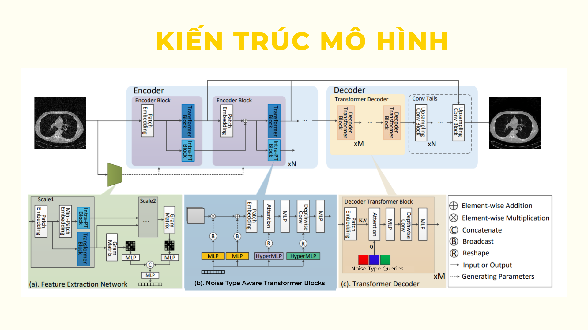
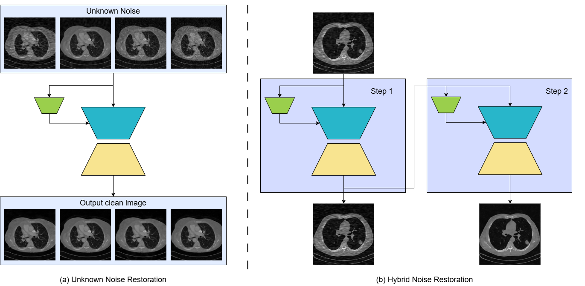
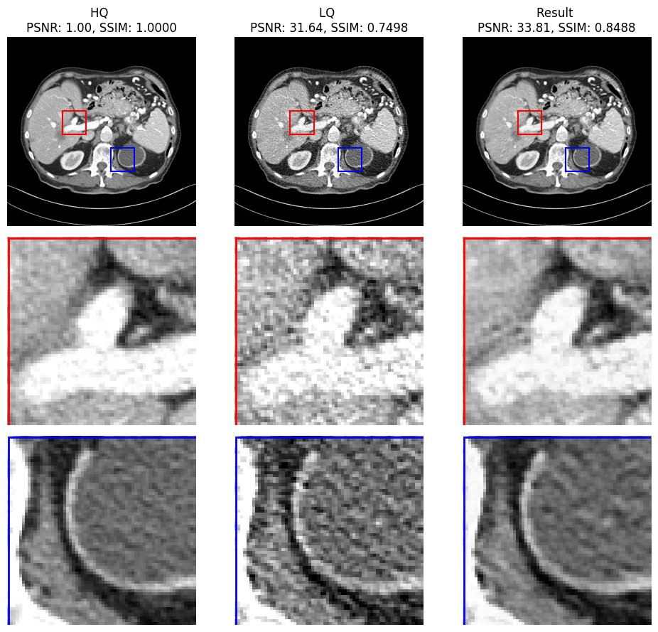
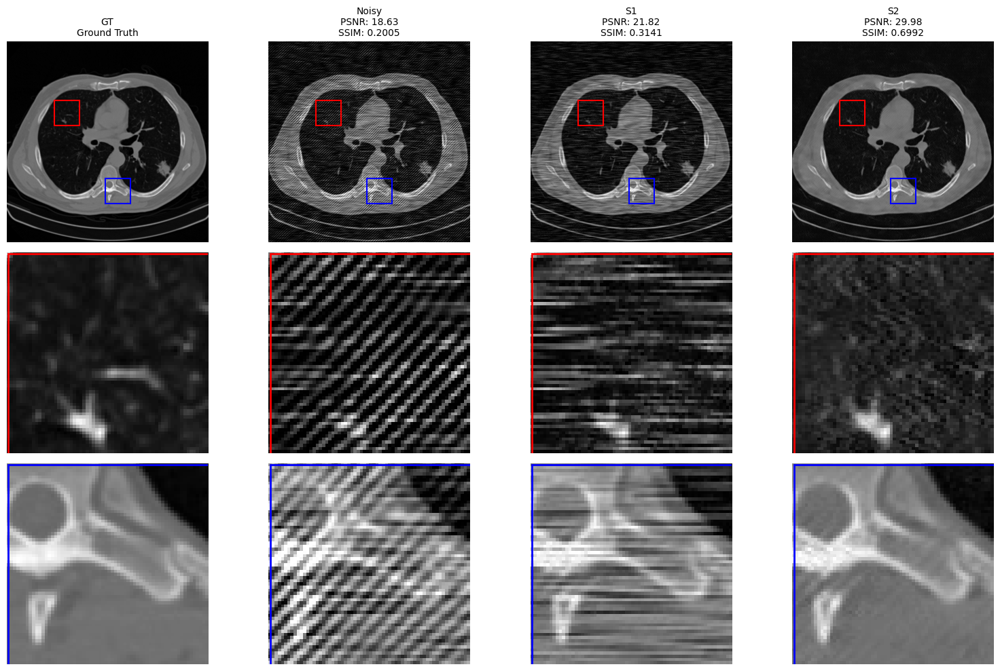

# [Capstone project 2025] MRFormer: Multi stage Restoration CT Image

My capstone project focuses on image restoration and super-resolution for CT images. it's based on paper [MWFormer](https://ieeexplore.ieee.org/abstract/document/10767188)

## Architecture


The architecture of MRFormer. The main image processing network consists of a Transformer encoder, a Transformer decoder, and convolution tails. (a) A feature extraction network learns to generate some of the parameters of the Transformer blocks and intra-patch Transformer blocks in the main network, thereby partially controlling the production of intermediate feature maps. (b) The Transformer block in the encoder of the main network, which is guided by the feature vector. (c) Transformer decoder of the main network, whose queries are learnable parameters.

## Different Variants


In addition to the default architecture, I also developed test-time variants applied in special cases. Conduct a single Noise-type restoration with the feature extraction network. To conduct hybrid Noise restoration that Ire unseen during training, the image processing network is cascaded to remove degradations sequentially, stage by stage.

## Results

### Results on LDCT images



### Results on hybrid-Noise degradations unseen during training



## 📦 Installation

1. Clone the repository:

```bash
git clone https://github.com/Chonn18/Capstone_project.git
cd Capstone_project/Backend

conda create -n mrformer python=3.10
conda activate mrformer
conda install pytorch==2.3.1 torchvision==0.18.1 torchaudio==2.3.1 pytorch-cuda=12.1 -c pytorch -c nvidia
conda install lightning==2.3.3 -c conda-forge

pip install -r requirements.txt
pip install mmcv-full==1.7.2 -f https://download.openmmlab.com/mmcv/dist/cu121/torch2.5.1/index.html
```

Run server

```bash
uvicorn main:app --host 0.0.0.0 --port 8000

ngrok start capstone
```
